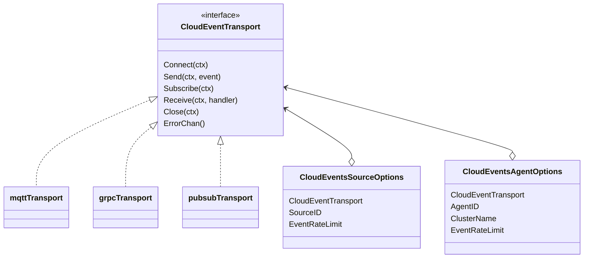
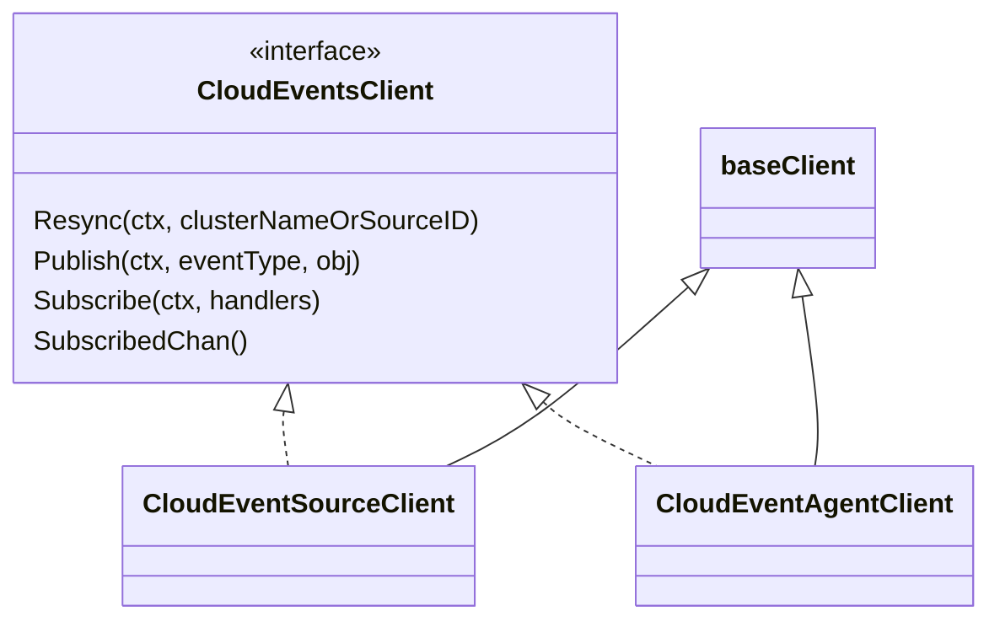
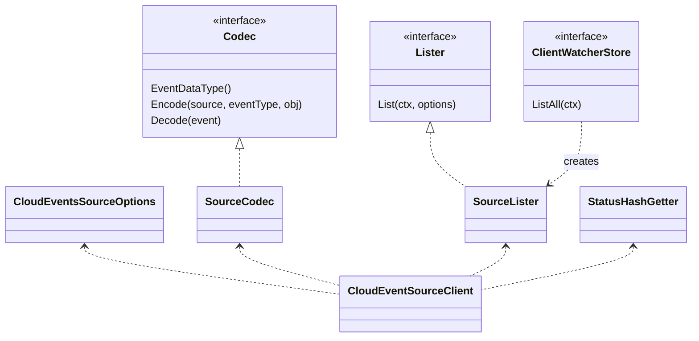
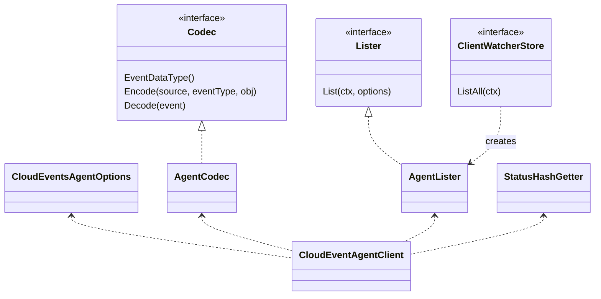
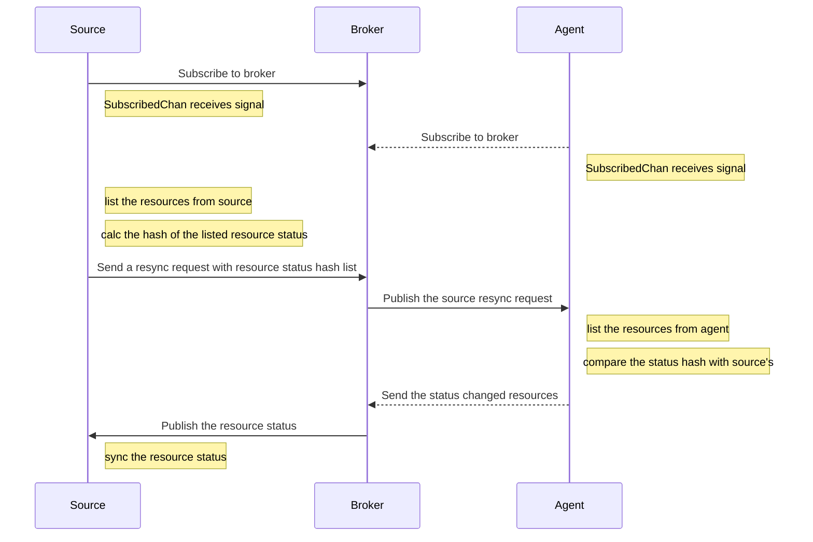
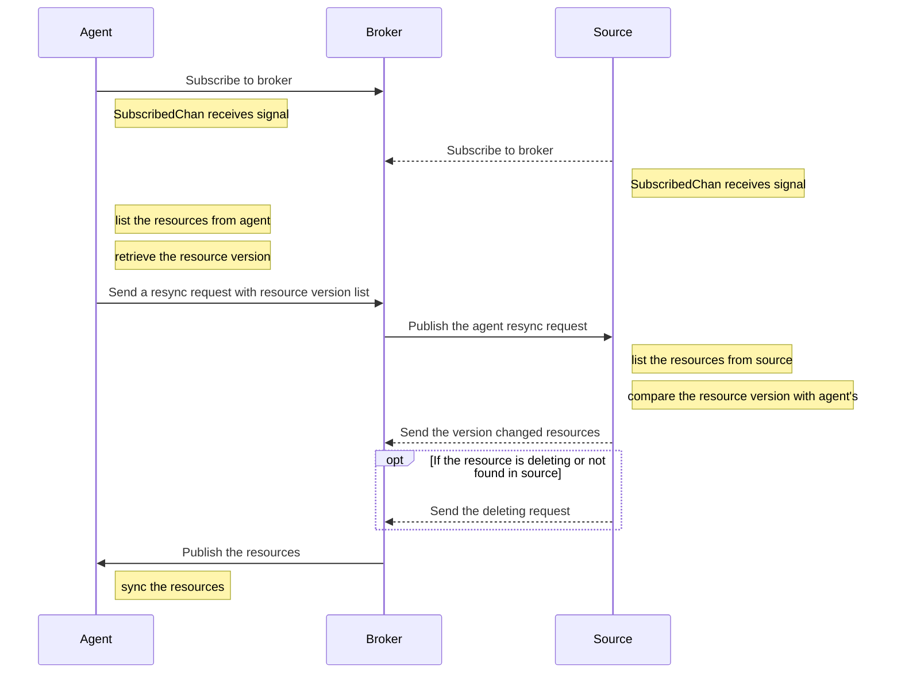
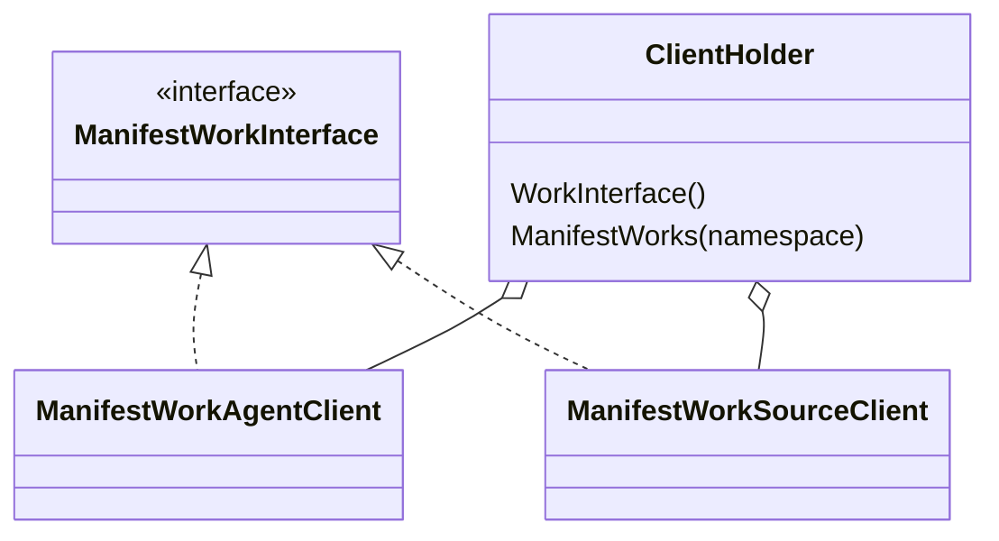
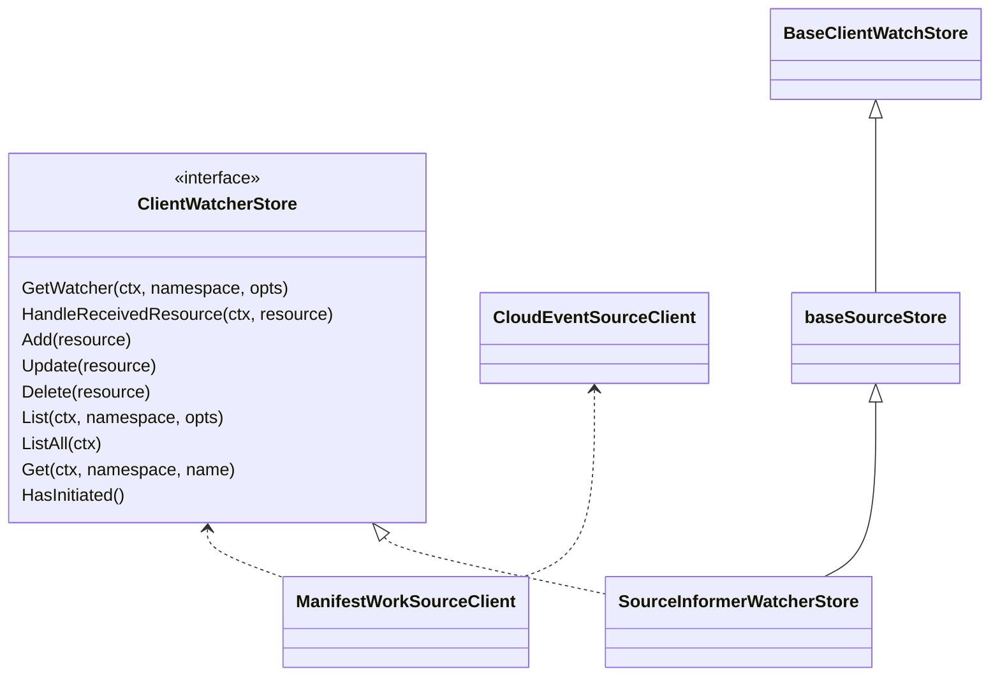
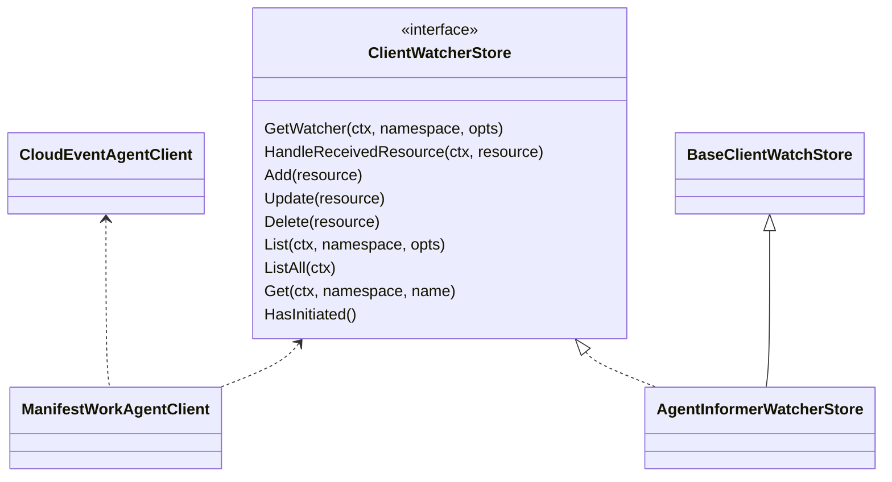
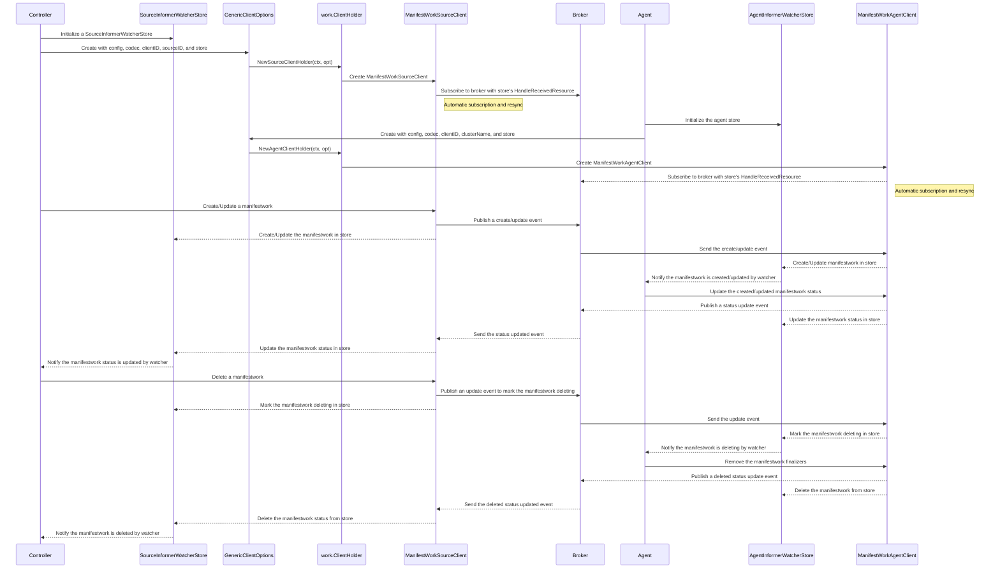

# Design Doc

## Overview

There are two types of client implementations in the `cloudevents` directory.

- In `generic` directory, there are two clients [`CloudEventSourceClient`](../generic/clients/sourceclient.go) and [`CloudEventAgentClient`](../generic/clients/agentclient.go), they implement the [`CloudEventsClient`](../generic/interface.go) interface to resync/publish/subscribe [`ResourceObject`](../generic/interface.go) between sources and agents with cloudevents. These clients are built using [`GenericClientOptions`](../clients/options/generic.go).
- In `work` directory, there are two client holders [`work.ClientHolder`](../clients/work/clientholder.go) that provide [`ManifestWorkSourceClient`](../clients/work/source/client/manifestwork.go) and [`ManifestWorkAgentClient`](../clients/work/agent/client/manifestwork.go). They are based on [`CloudEventSourceClient`](../generic/clients/sourceclient.go) and [`CloudEventAgentClient`](../generic/clients/agentclient.go) to implement the [`ManifestWorkInterface`](https://github.com/open-cluster-management-io/api/blob/main/client/work/clientset/versioned/typed/work/v1/manifestwork.go#L24), these clients are used for applying `ManifestWork` and retrieving `ManifestWork` status between source and work agent.

## Generic CloudEvents Clients

### Building Clients with GenericClientOptions

The [`GenericClientOptions`](../clients/options/generic.go) is the primary way to build cloudevents clients. It accepts:
- A protocol configuration (MQTT, gRPC, or PubSub options)
- A codec for encoding/decoding resources
- A client ID
- Source-specific or agent-specific parameters (source ID or cluster name)
- A watcher store for caching and watching resources

The `GenericClientOptions` provides two methods:
- `SourceClient(ctx)` - builds and returns a `CloudEventSourceClient` with automatic subscription and resync
- `AgentClient(ctx)` - builds and returns a `CloudEventAgentClient` with automatic subscription and resync

### CloudEventTransport Interface

The [`CloudEventTransport`](../generic/options/options.go) interface defines a transport that sends/receives cloudevents based on different event protocols.

The transport handles:
- Connection management (`Connect`, `Close`)
- Sending events (`Send`)
- Subscribing to topics/services (`Subscribe`)
- Receiving events (`Receive`)
- Error notification (`ErrorChan`)

Currently, MQTT, gRPC and Pub/Sub transports are implemented.

### CloudEventsClient Interface

The [`CloudEventsClient`](../generic/interface.go) interface defines a client that resync/publish/subscribe [`ResourceObject`](../generic/interface.go) between sources and agents with cloudevents, the [`ResourceObject`](../generic/interface.go) interface defines an object that can be published/subscribed by `CloudEventsClient`.

The [`CloudEventSourceClient`](../generic/clients/sourceclient.go) and [`CloudEventAgentClient`](../generic/clients/agentclient.go) implement the `CloudEventsClient` interface for source and agent.

These two clients are based on [`baseClient`](../generic/clients/baseclient.go), the `baseClient` uses the given `CloudEventTransport` to publish/subscribe resources and handle transport errors. When the transport is successfully subscribed, the `baseClient` sends a signal to the subscribed channel, allowing the caller to trigger resync operations.

The `CloudEventSourceClient` is built through `GenericClientOptions.SourceClient()` and depends on the following objects:

- A `CloudEventsSourceOptions`, it provides a `CloudEventTransport` that will be used by `CloudEventSourceClient` to send/receive cloudevents.
- A lister (created from `ClientWatcherStore`), it is used to list the `ResourceObject` that are maintained by source when resync happens.
- A `StatusHashGetter` function, it is used to calculate the hash of resource status, this function will be invoked when a source client sends resync request to agent.
- A codec that implements the [`Codec`](../generic/interface.go) interface, it is used to encode/decode the `ResourceObject`/`cloudevents.Event` to `cloudevents.Event`/`ResourceObject`.

The `CloudEventAgentClient` is built through `GenericClientOptions.AgentClient()` and depends on the following objects:

- A `CloudEventsAgentOptions`, it provides a `CloudEventTransport` that will be used by `CloudEventAgentClient` to send/receive cloudevents.
- A lister (created from `ClientWatcherStore`), it is used to list the `ResourceObject` that are maintained by agent when resync happens.
- A `StatusHashGetter` function, it is used to calculate the hash of resource status, this function will be invoked when an agent client responds to the source resync request.
- A codec that implements the [`Codec`](../generic/interface.go) interface, it is used to encode/decode the `ResourceObject`/`cloudevents.Event` to `cloudevents.Event`/`ResourceObject`.

**Note**: to resync the resource status, the `StatusHashGetter` function should be same for `CloudEventSourceClient` and `CloudEventAgentClient`

#### CloudEventsClient Resync Resources

The resync process is triggered automatically after the client successfully subscribes to the broker. The `GenericClientOptions.SourceClient()` and `GenericClientOptions.AgentClient()` methods handle this automatically by listening to the `SubscribedChan()` and triggering a resync when the signal is received.

1. Source resync resource status from agent

2. Agent resync resources from source

## ManifestWork CloudEvents Clients

There are two clients [`ManifestWorkSourceClient`](../clients/work/source/client/manifestwork.go) and [`ManifestWorkAgentClient`](../clients/work/agent/client/manifestwork.go), both of them implement the [`ManifestWorkInterface`](https://github.com/open-cluster-management-io/api/blob/main/client/work/clientset/versioned/typed/work/v1/manifestwork.go#L24).

These clients are created and managed by [`work.ClientHolder`](../clients/work/clientholder.go), which provides:
- `NewSourceClientHolder(ctx, opt)` - builds a source client holder with ManifestWork source client
- `NewAgentClientHolder(ctx, opt)` - builds an agent client holder with ManifestWork agent client

### ManifestWorkSourceClient

The `ManifestWorkSourceClient` is used for source part, it depends on [`CloudEventSourceClient`](../generic/clients/sourceclient.go) and [`ClientWatcherStore`](../clients/store/interface.go).

The `ManifestWorkSourceClient` uses `CloudEventSourceClient` to:
- Publish the manifestworks and status resync request from a source to the agent
- Subscribe to the agent to receive the manifestworks status

For source part, the [`SourceInformerWatcherStore`](../clients/work/store/informer.go) is the recommended store implementation. This store integrates with a Kubernetes informer's store, and the `ManifestWorkSourceClient` uses this store to:
- Get/list manifestworks from the given informer store
- Add/update/delete the manifestworks with the given informer store
- Get a [`watcher`](../clients/store/watcher.go) that is provided by this store
- Handle the manifestworks status received from agent and send the received manifestworks status to the watcher

The `SourceInformerWatcherStore` is extended from [`baseSourceStore`](../clients/work/store/base.go), the `baseSourceStore` implements the `HandleReceivedResource` method. When the `ManifestWorkSourceClient` starts, it subscribes to broker(agent) with this handler function. When the `ManifestWorkSourceClient` receives the manifestworks status from agent, it calls this handler to handle the manifestworks status update.

The `baseSourceStore` is also extended from [`BaseClientWatchStore`](../clients/store/base.go) that implements the `Get`, `List` and `ListAll` methods to get/list manifestworks from the store.

### ManifestWorkAgentClient

The `ManifestWorkAgentClient` depends on [`CloudEventAgentClient`](../generic/clients/agentclient.go) and [`ClientWatcherStore`](../clients/store/interface.go).

The `ManifestWorkAgentClient` uses `CloudEventAgentClient` to:
- Publish the manifestworks status and spec resync request from agent to source
- Subscribe to source to receive the manifestworks

For agent part, the [`AgentInformerWatcherStore`](../clients/work/store/informer.go) implements the `ClientWatcherStore`. The `ManifestWorkAgentClient` uses this store to:
- Get/list manifestworks from the store
- Add/update/delete the manifestworks with the store
- Get a [`watcher`](../clients/store/watcher.go) that is provided by this store
- Handle the manifestworks received from source and send the received manifestworks to the watcher

The `AgentInformerWatcherStore` maintains its own versioning for resources and provides watch capability through the watcher.

A developer needs to create a `ManifestWorkInformer` and start the informer when using the `ManifestWorkAgentClient` with `AgentInformerWatcherStore`.

The `AgentInformerWatcherStore` is extended from the generic [`AgentInformerWatcherStore`](../clients/store/informer.go) in the store package.

### Create/Update/Delete a manifestwork from source to agent

